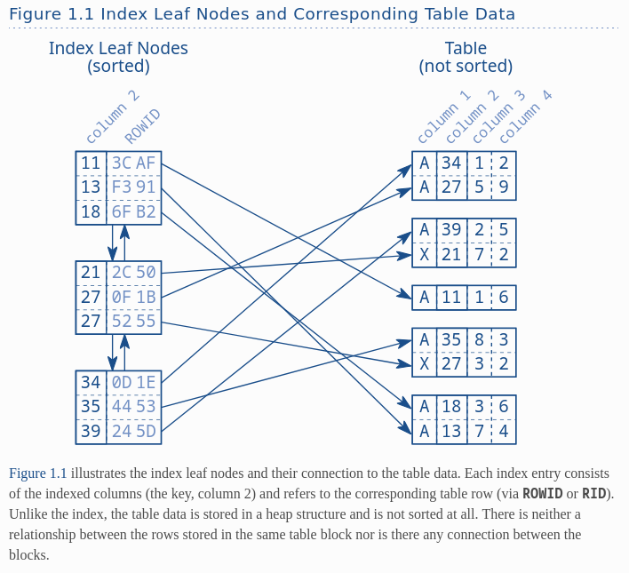
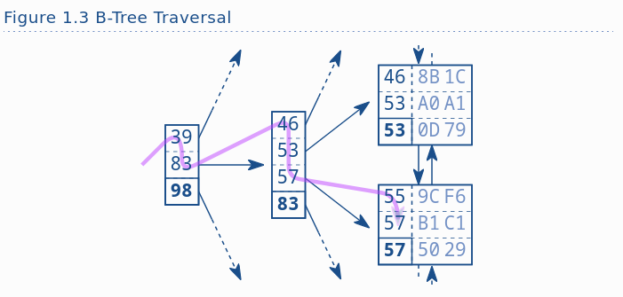

# Summary

Index 
- a structure in database built using create index
- requires own disk space
- primary purpose to provide an ordered representation of indexed data

# Leaf nodes

The logical order is established via a doubly linked list. New nodes are inserted between two existing nodes by 
updating their links to refer to the new node. The physical location of the new node doesn’t matter because the 
doubly linked list maintains the logical order. This enables the database to read the index forwards or backwards as 
needed. It is thus possible to insert new entries without moving large amounts of data—it just needs to change some 
pointers.

Databases use doubly linked lists to connect the so-called index leaf nodes. Each leaf node is stored in a database 
block or page; that is, the database’s smallest storage unit. All index blocks are of the same size—typically a few 
kilobytes. The database uses the space in each block to the extent possible and stores as many index entries as 
possible in each block. That means that the index order is maintained on two different levels: the index entries 
within each leaf node, and the leaf nodes among each other using a doubly linked list.

# B-Tree

The index leaf nodes are stored in an arbitrary order—the position on the disk does not correspond to the logical 
position according to the index order. It is like a telephone directory with shuffled pages. If you search for 
“Smith” but first open the directory at “Robinson”, it is by no means granted that Smith follows Robinson. A 
database needs a second structure to find the entry among the shuffled pages quickly: a balanced search tree—in 
short: the B-tree.

Figure 1.2 shows an example index with 30 entries. The doubly linked list establishes the logical order between the 
leaf nodes. The root and branch nodes support quick searching among the leaf nodes.

The structure is a balanced search tree because the tree depth is equal at every position; the distance between 
root node and leaf nodes is the same everywhere.

Figure 1.3 shows an index fragment to illustrate a search for the key “57”. The tree traversal starts at the root 
node on the left-hand side. Each entry is processed in ascending order until a value is greater than or equal to 
(>=) the search term (57). In the figure it is the entry 83. The database follows the reference to the 
corresponding branch node and repeats the procedure until the tree traversal reaches a leaf node.

Real world indexes with millions of records have a tree depth of four or five.

# Slow Indexes

An index lookup requires three steps: 
- the tree traversal; 
- following the leaf node chain; 
- fetching the table data. 

The tree traversal is the only step that has an upper bound for the number of accessed blocks—the index depth. The 
other two steps might need to access many blocks—they cause a slow index lookup.

## Types of scans

The Oracle database is rather verbose in this respect and has three distinct operations that describe a basic index 
lookup:
- INDEX UNIQUE SCAN
    The INDEX UNIQUE SCAN performs the tree traversal only. The Oracle database uses this operation if a unique 
  constraint ensures that the search criteria will match no more than one entry.

- INDEX RANGE SCAN
    The INDEX RANGE SCAN performs the tree traversal and follows the leaf node chain to find all matching entries. 
  This is the fallback operation if multiple entries could possibly match the search criteria.

- TABLE ACCESS BY INDEX ROWID
    The TABLE ACCESS BY INDEX ROWID operation retrieves the row from the table. This operation is (often) performed 
  for every matched record from a preceding index scan operation.

The important point is that an INDEX RANGE SCAN can potentially read a large part of an index. If there is one more 
table access for each row, the query can become slow even when using an index.