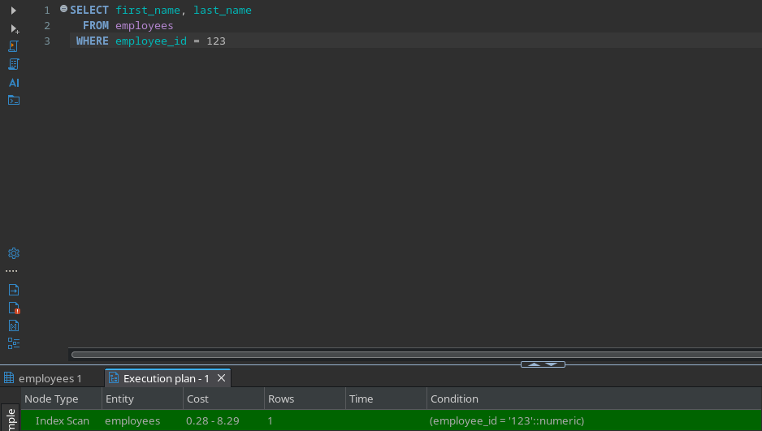
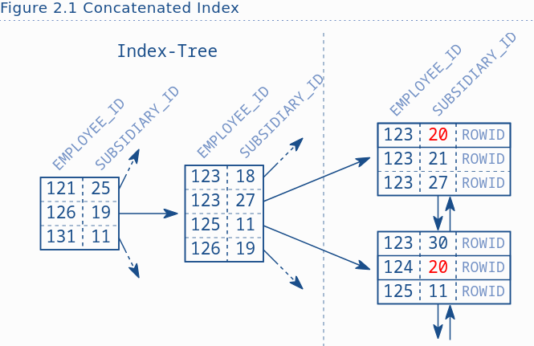
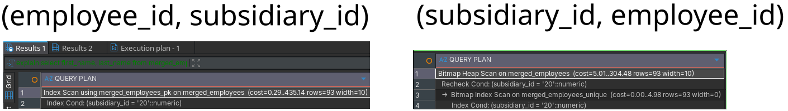
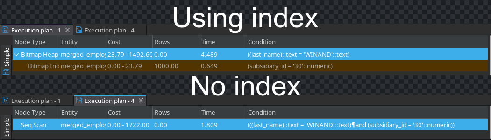
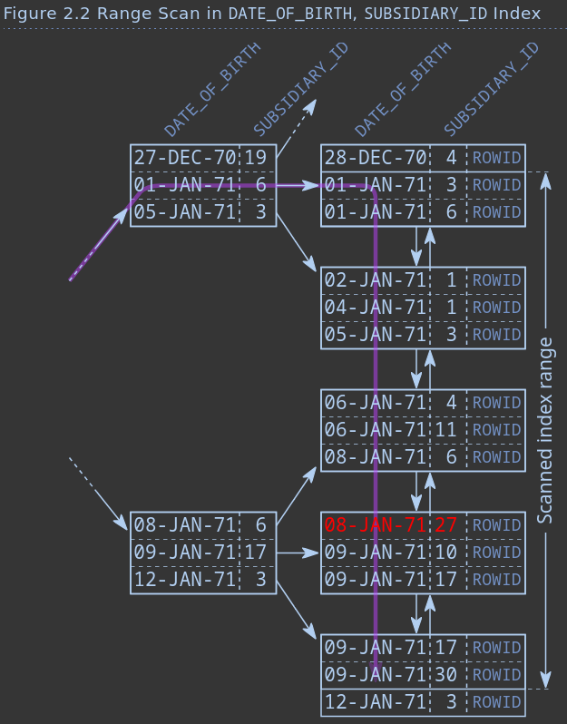
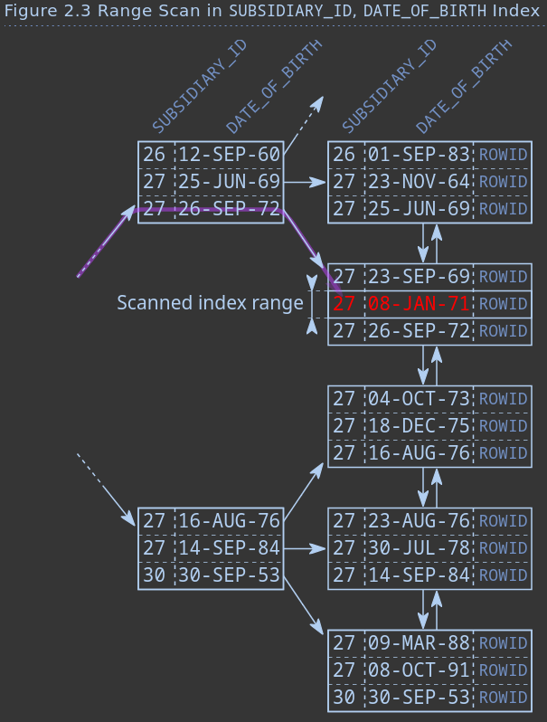
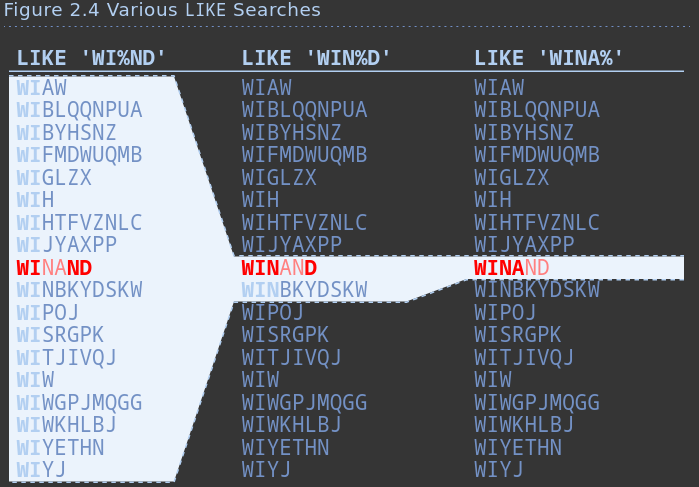

# Equality Operator

## Primary keys

The database automatically creates an index for the primary key.



The PostgreSQL operation Index Scan combines the INDEX [UNIQUE/RANGE] SCAN and TABLE ACCES BY INDEX ROWID operations from the Oracle Database. It is not visible from the execution plan if the index access might potentially return more than one row. After accessing the index, the database must do one more step to fetch the queried data (FIRST_NAME, LAST_NAME) from the table storage: the TABLE ACCESS BY INDEX ROWID operation.

## Multi-column Indexes

A multi-column index is just a B-tree index like any other that keeps the indexed data in a sorted list. The database considers each column according to its position in the index definition to sort the index entries. The first column is the primary sort criterion and the second column determines the order only if two entries have the same value in the first column and so on.



The index excerpt in Figure 2.1 shows that the entries for subsidiary 20 are not stored next to each other. It is also apparent that there are no entries with SUBSIDIARY_ID = 20 in the tree, although they exist in the leaf nodes. The tree is therefore useless for this query.

Example:  
CREATE UNIQUE INDEX employees_pk
    ON employees (employee_id, subsidiary_id)  
If we use only subsidiary_id in a where clause, index will not be used.

Full table scan can be the most efficient operation in some cases, in particular when retrieving a large part of the table. This is partly due to the overhead for the index lookup itself, which does not happen for a full table scan operation. This is mostly because an index lookup reads one block after the other as the database does not know which block to read next until the current block has been processed. A FULL TABLE SCAN must get the entire table anyway so that the database can read larger chunks at a time (multi block read). Although the database reads more data, it might need to execute fewer read operations.



The PostgreSQL db uses two operations when reversing index and using (subsidiary_id, employee_id): a Bitmap Index Scan followed by a Bitmap Heap Scan. They roughly correspond to Oracle’s INDEX RANGE SCAN and TABLE ACCESS BY INDEX ROWID with one important difference: it first fetches all results from the index (Bitmap Index Scan), then sorts the rows according to the physical storage location of the rows in the heap table and then fetches all rows from the table (Bitmap Heap Scan). This method reduces the number of random access IOs on the table.

## Slow indexes Pt II

The query optimizer, or query planner, is the database component that transforms an SQL statement into an execution plan. This process is also called compiling or parsing. There are two distinct optimizer types.

Cost-based optimizers (CBO) generate many execution plan variations and calculate a cost value for each plan. The cost calculation is based on the operations in use and the estimated row numbers. In the end the cost value serves as the benchmark for picking the “best” execution plan.

Rule-based optimizers (RBO) generate the execution plan using a hard-coded rule set. Rule based optimizers are less flexible and are seldom used today.

Creating an index can sometimes lead to slowing down other queries.
```sql
/* Using (subsidiary_id, employee_id) index for this query is slower
because the index lookup returns many ROWIDs */
SELECT first_name, last_name, subsidiary_id, phone_number
FROM merged_employees
WHERE last_name  = 'WINAND'
AND subsidiary_id = 30
```


# Functions

## Case-Insensitive Search Using UPPER or LOWER

```sql
/* Despite having an index on last_name, it is not used because the search is on upper(last_name) */
SELECT first_name, last_name, phone_number
FROM employees
WHERE UPPER(last_name) = UPPER('winand')
```

Sometimes ORM tools use UPPER and LOWER without the developer’s knowledge. Hibernate, for example, 
injects an implicit LOWER for case-insensitive searches.

Sometimes we can get contradicting estimates (e.g. previous index scan returning only 40 rows, 
and current estimate fetching 100 rows). Contradicting estimates like this often indicate problems with the statistics.
(More about statistics here https://www.postgresql.org/docs/current/catalog-pg-statistic.html)

## User-Defined Functions

Only deterministic functions marked with immutable can be indexed.

# Parameterized Queries

Dynamic parameters or bind variables are an alternative way to pass data to the database. 
Instead of putting the values directly into the SQL statement, you just use a placeholder like ?, :name or @name and provide the actual values using a separate API call.

2 Good reasons to use bind parameters:
- Security (prevents SQL injection)
- Performance (execution plan cache)

```
Column histograms are most useful if the values are not uniformly distributed.

For columns with uniform distribution, it is often sufficient to divide the number of 
distinct values by the number of rows in the table. This method also works when using bind parameters.
```

If we compare the optimizer to a compiler, bind variables are like program variables, 
but if you write the values directly into the statement they are more like constants. 
The database can use the values from the SQL statement during optimization just like a compiler can 
evaluate constant expressions during compilation. Bind parameters are, put simply, not visible to the optimizer just 
as the runtime values of variables are not known to the compiler.

Generating and evaluating all execution plan variants is a huge effort that 
does not pay off if you get the same result in the end anyway. 
Not using bind parameters is like recompiling a program every time.

Bind parameters cannot change the structure of an SQL statement. That means you cannot use bind parameters for table or column names. 
The following bind parameters do not work:

```
String sql = prepare("SELECT * FROM ? WHERE ?");

sql.execute('employees', 'employee_id = 1');
```
If you need to change the structure of an SQL statement during runtime, use dynamic SQL.

# Searching for Ranges

## Greater, Less & Between

The biggest performance risk of an INDEX RANGE SCAN is the leaf node traversal. 
It is therefore the golden rule of indexing to keep the scanned index range as small as possible. You can check 
that by asking yourself where an index scan starts and where it ends.

The question is easy to answer if the SQL statement mentions the start and stop conditions explicitly:
```sql 
SELECT first_name, last_name, date_of_birth
FROM employees
WHERE date_of_birth >= TO_DATE(?, 'YYYY-MM-DD')
AND date_of_birth <= TO_DATE(?, 'YYYY-MM-DD')
```

The start and stop conditions are less obvious if a second column becomes involved:
```sql
SELECT first_name, last_name, date_of_birth
FROM employees
WHERE date_of_birth >= TO_DATE(?, 'YYYY-MM-DD')
AND date_of_birth <= TO_DATE(?, 'YYYY-MM-DD')
AND subsidiary_id  = ?
```

The following figures show the effect of the column order on the scanned index range. 
For this illustration we search all employees of subsidiary 27 who were born between January 1st and January 9th 1971.



The index is ordered by birth dates first. Only if two employees were born on the same day is the SUBSIDIARY_ID used 
to sort these records. The query, however, covers a date range. 
The ordering of SUBSIDIARY_ID is therefore useless during tree traversal. 
That becomes obvious if you realize that there is no entry for subsidiary 27 in the 
branch nodes—although there is one in the leaf nodes. 
The filter on DATE_OF_BIRTH is therefore the only condition 
that limits the scanned index range. It starts at the first entry matching the 
date range and ends at the last one—all five leaf nodes.



The difference is that the equals operator limits the first index column to a single value. 
Within the range for this value (SUBSIDIARY_ID 27) the index is sorted according to the second column—the 
date of birth—so there is no need to visit the first leaf node because the branch node already indicates that 
there is no employee for subsidiary 27 born after June 25th 1969 in the first leaf node.

The tree traversal directly leads to the second leaf node. In this case, 
all where clause conditions limit the scanned index range so that the scan terminates at the very same leaf node.

**Rule of thumb: index for equality first—then for ranges.**

To optimize performance, it is very important to know the scanned index range.
```
                            QUERY PLAN
-------------------------------------------------------------------
Index Scan using emp_test on employees
  (cost=0.01..8.59 rows=1 width=16)
  Index Cond: (date_of_birth >= to_date('1971-01-01','YYYY-MM-DD'))
          AND (date_of_birth <= to_date('1971-01-10','YYYY-MM-DD'))
          AND (subsidiary_id = 27::numeric)

The PostgreSQL database does not indicate index access and filter predicates in the execution plan. 
However, the Index Cond section lists the columns in order of the index definition. In that case, 
we see the two DATE_OF_BIRTH predicates first, then the SUBSIDIARY_ID. 
Knowing that any predicates following a range condition cannot be an access predicate 
the SUBSIDIARY_ID must be a filter predicate. 
```

The database can use all conditions as access predicates if we turn the index definition around:
```
                            QUERY PLAN
-------------------------------------------------------------------
Index Scan using emp_test on employees
   (cost=0.01..8.29 rows=1 width=17)
   Index Cond: (subsidiary_id = 27::numeric)
           AND (date_of_birth >= to_date('1971-01-01', 'YYYY-MM-DD'))
           AND (date_of_birth <= to_date('1971-01-10', 'YYYY-MM-DD'))

The PostgreSQL database does not indicate index access and filter predicates in the execution plan. 
However, the Index Cond section lists the columns in order of the index definition. In that case, 
we see the SUBSIDIARY_ID predicate first, then the two on DATE_OF_BIRTH. As there is no further column filtered 
after the range condition on DATE_OF_BIRTH we know that all predicates can be used as access predicate.
```

## Indexing LIKE Filters

LIKE filters can only use the characters before the first wild card during tree traversal. 
The remaining characters are just filter predicates that do not narrow the scanned index range. 
A single LIKE expression can therefore contain two predicate types: 
- the part before the first wild card as an access predicate; 
- the other characters as a filter predicate.

The LIKE operator works on a character-by-character basis while collations can treat 
multiple characters as a single sorting item. Thus, some collations prevent using indexes for LIKE.
(https://www.cybertec-postgresql.com/en/indexing-like-postgresql-oracle/)

The more selective the prefix before the first wild card is, the smaller the scanned index range becomes.



The position of the wild card characters affects index usage—at least in theory. 
In reality the optimizer creates a generic execution plan when the search term is supplied via bind parameters. 
In that case, the optimizer has to guess whether the majority of executions will have a leading wild card.
Most databases just assume that there is no leading wild card when optimizing a LIKE condition with bind parameter, 
but this assumption is wrong if the LIKE expression is used for a full-text search. 
There is, unfortunately, no direct way to tag a LIKE condition as full-text search.
Specifying the search term without bind parameter is the most obvious solution, 
but that increases the optimization overhead and opens an SQL injection vulnerability. 

An effective but still secure and portable solution is to intentionally obfuscate the LIKE condition.
When using the LIKE operator for a full-text search, we could separate the wildcards from the search term:
**WHERE text_column LIKE '%' || ? || '%'**

For the PostgreSQL database, the problem is different because PostgreSQL assumes there is a leading wild card 
when using bind parameters for a LIKE expression. PostgreSQL just does not use an index in that case. 
The only way to get an index access for a LIKE expression is to make the actual search term visible to the optimizer.

Even if the database optimizes the execution plan for a leading wild card, 
it can still deliver insufficient performance. You can use another part of the where clause to access the data 
efficiently in that case. If there is no other access path, you might use one of the following proprietary full-text 
index solutions.

PostgreSQL offers the @@ operator to implement full-text searches.
Another option is to use the WildSpeed extension to optimize LIKE expressions directly. 
The extension stores the text in all possible rotations so that each character is at the beginning once. 
That means that the indexed text is not only stored once 
but instead as many times as there are characters in the string—thus it needs a lot of space.

Exercise: How can you index a LIKE search that has only one wild card at the beginning of the search term ('%TERM')?
Answer:
- Reverse the string and index that (naive solution)
- Trigram / n-gram indexes (GIN - Generalized Inverted Index in postgres)

## Index Merge

Is it better to create one index for each column or a single index for all columns of a where clause? 
In most cases: one index with multiple columns is better.

Databases use two methods to combine indexes: 
- Index join. 
- Functionality from the data warehouse world.

Data warehouses use a special purpose index type to solve that problem: bitmap index. 
The advantage of bitmap indexes is that they can be combined rather easily. That means you get decent performance 
when indexing each column individually. Conversely, if you know the query in advance, so that you can create a 
tailored multi-column B-tree index, it will still be faster than combining multiple bitmap indexes.

By far the greatest weakness of bitmap indexes is the ridiculous insert, update and delete scalability. 
Concurrent write operations are virtually impossible. That is no problem in a data warehouse because the 
load processes are scheduled one after another. In online applications, bitmap indexes are mostly useless.

Many database products offer a hybrid solution between B-tree and bitmap indexes. 
In the absence of a better access path, they convert the results of several B-tree scans into 
in-memory bitmap structures. Those can be combined efficiently. The bitmap structures are not 
stored persistently but discarded after statement execution, thus bypassing the problem of the poor write scalability. 
The downside is it needs a lot of memory and CPU time. This method is, after all, an optimizer’s act of desperation.

# Partial indexes

With partial indexes you can also specify the rows that are indexed. A partial index is useful for commonly used 
where conditions that use constant values—like the status code in the following example:
```sql
SELECT message
  FROM messages
 WHERE processed = 'N'
   AND receiver  = ?
```

Queries like this are very common in queuing systems. The query fetches all unprocessed messages 
for a specific recipient. Messages that were already processed are rarely needed. 
If they are needed, they are usually accessed by a more specific criteria like the primary key.

We can optimize this query with a two-column index. 
Considering this query only, the column order does not matter because there is no range condition.

```sql
CREATE INDEX messages_todo 
    ON messages (receiver, processed)
```

The index fulfills its purpose, but it includes many rows that are never searched, 
namely all the messages that were already processed. Due to the logarithmic scalability, the index 
nevertheless makes the query very fast even though it wastes a lot of disk space.

With partial indexing you can limit the index to include only the unprocessed messages. 
The syntax for this is surprisingly simple: a where clause.

```sql
CREATE INDEX messages_todo
          ON messages (receiver)
       WHERE processed = 'N'
```

The index only contains the rows that satisfy the where clause. This means queries that do not include column 
partial index was built on (e.g. receiver in our example) can still make use of the index if it satisfies where 
condition.

In this particular case, we can even remove the PROCESSED column because it is always 'N' anyway. 
That means the index reduces its size in two dimensions: 
- vertically - because it contains fewer rows 
- horizontally - due to the removed column

# Obfuscated conditions (anti-patterns every developer should know about and avoid.)

## Date Types

A common obfuscation is to compare dates as strings as shown in the following PostgreSQL example:
```sql
SELECT ...
FROM sales
WHERE TO_CHAR(sale_date, 'YYYY-MM-DD') = '1970-01-01'
```

The problem is converting SALE_DATE. Such conditions are often created in the belief that you cannot 
pass different types than numbers and strings to the database. Bind parameters, however, support all data types. 
That means you can for example use a java.util.Date object as bind parameter.

If you cannot do that, you just have to convert the search term instead of the table column:

```sql
SELECT ...
  FROM sales
 WHERE sale_date = TO_DATE('1970-01-01', 'YYYY-MM-DD')
```

This query can use a straight index on SALE_DATE. Moreover, it converts the input string only once. The previous 
statement must convert all dates stored in the table before it can compare them against the search term.

Whatever change you make—using a bind parameter or converting the other side of the comparison—you can easily 
introduce a bug if SALE_DATE has a time component. You must use an explicit range condition in that case:

```sql
SELECT ...
FROM sales
WHERE sale_date >= TO_DATE('1970-01-01', 'YYYY-MM-DD')
AND sale_date <  TO_DATE('1970-01-01', 'YYYY-MM-DD')
+ INTERVAL '1' DAY
```

Always consider using an explicit range condition when comparing dates.

## Numeric Strings

Numeric strings are numbers that are stored in text columns. Although it is a very bad practice, 
it does not automatically render an index useless if you consistently treat it as string:
```sql
SELECT ...
FROM ...
WHERE numeric_string = '42'
```

Of course this statement can use an index on NUMERIC_STRING. If you compare it using a number, however, the 
database can no longer use this condition as an access predicate.
```sql
SELECT ...
FROM ...
WHERE numeric_string = 42
```

Note the missing quotes. Although some database yield an error (e.g. PostgreSQL) many databases 
just add an implicit type conversion.