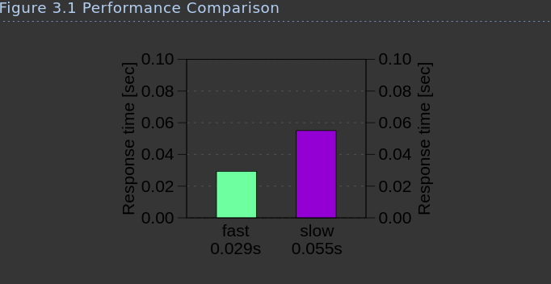
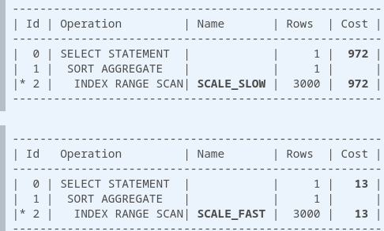
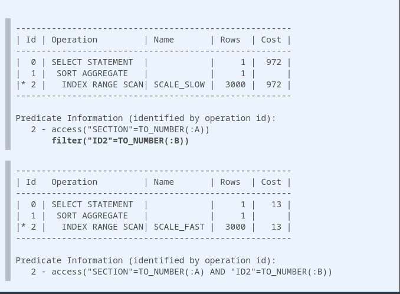

# Performance Impacts of Data Volume

The amount of data stored in a database has a great impact on its performance. It is usually accepted that a query 
becomes slower with additional data in the database. But how great is the performance impact if the data volume 
doubles? And how can we improve this ratio?

As an example we analyze the response time of the following query when using two different indexes. The index 
definitions will remain unknown for the time being—they will be revealed during the course of the discussion.

```sql
SELECT count(*)
  FROM scale_data
 WHERE section = ?
   AND id2 = ?
```

The column SECTION has a special purpose in this query: it controls the data volume. The bigger the SECTION number 
becomes, the more rows the query selects. Figure 3.1 shows the response time for a small SECTION.



There is a considerable performance difference between the two indexing variants. Both response times are still well 
below a tenth of a second so even the slower query is probably fast enough in most cases. However, the performance 
chart shows only one test point. Discussing scalability means to look at the performance impact when changing 
environmental parameters—such as the data volume.

Figure 3.2 shows the response time over the SECTION number—that means for a growing data volume.


The chart shows a growing response time for both indexes. On the right hand side of the chart, when the data volume 
is a hundred times as high, the faster query needs more than twice as long as it originally did while the response 
time of the slower query increased by a factor of 20 to more than one second.

If a query is fast enough under certain testing conditions, it does not mean it will be fast enough in production. 
That is especially the case in development environments that have only a fraction of the data of the production system.

It is, however, no surprise that the queries get slower when the data volume grows. But the striking gap between the 
two indexes is somewhat unexpected. What is the reason for the different growth rates?

It should be easy to find the reason by comparing both execution plans.



The execution plans are almost identical—they just use a different index. Even though the cost values reflect the 
speed difference, the reason is not visible in the execution plan.

It seems like we are facing a “slow index experience”; the query is slow, although it uses an index. Nevertheless, we 
do not believe in the myth of the “broken index” anymore. Instead, we remember the two ingredients that make an 
index lookup slow: (1) the table access, and (2) scanning a wide index range

Neither execution plan shows a TABLE ACCESS BY INDEX ROWID operation so one execution plan must scan a wider index 
range than the other. So where does an execution plan show the scanned index range? In the predicate information of 
course!

The predicate information is by no means an unnecessary detail you can omit as was done above. An execution plan 
without predicate information is incomplete. That means you cannot see the reason for the performance difference in 
the plans shown above. If we look at the complete execution plans, we can see the difference.



The difference is obvious now: only the condition on SECTION is an access predicate when using the SCALE_SLOW index. 
The database reads all rows from the section and discards those not matching the filter predicate on ID2. The 
response time grows with the number of rows in the section. With the SCALE_FAST index, the database uses all 
conditions as access predicates. The response time grows with the number of selected rows.

The last missing pieces in our puzzle are the index definitions. Can we reconstruct the index definitions from the 
execution plans?

The definition of the SCALE_SLOW index must start with the column SECTION—otherwise it could not be used as access 
predicate. The condition on ID2 is not an access predicate—so it cannot follow SECTION in the index definition. 
That means the SCALE_SLOW index must have minimally three columns where SECTION is the first and ID2 not the second.
That is exactly how it is in the index definition used for this test: 
CREATE INDEX scale_slow ON scale_data (section, id1, id2)

The column ID1 was just added so this index has the same size as SCALE_SLOW—otherwise you might get the impression 
the size causes the difference.