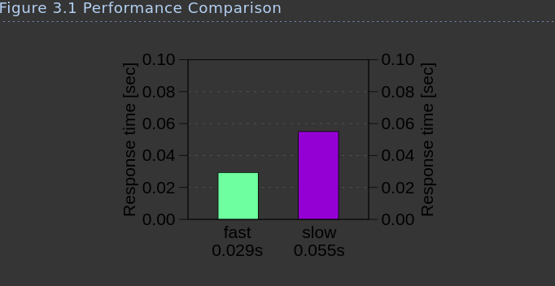
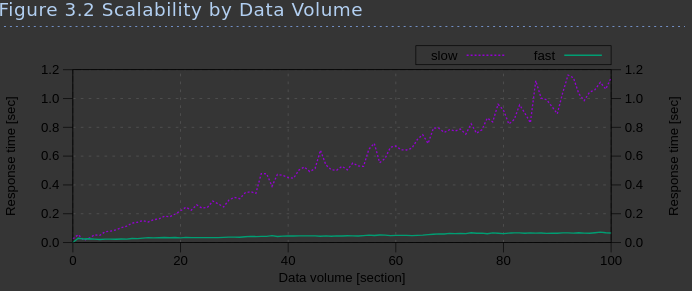
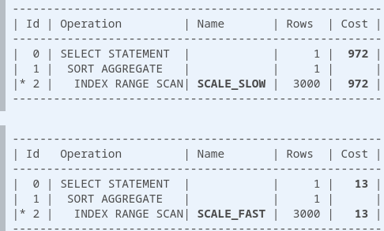
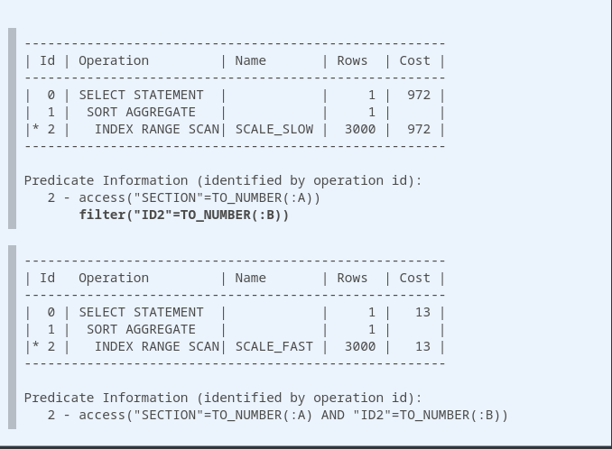
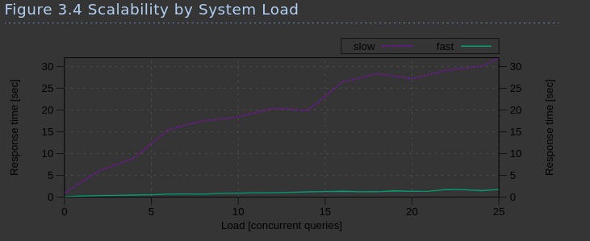

# Performance Impacts of Data Volume

The amount of data stored in a database has a great impact on its performance. It is usually accepted that a query 
becomes slower with additional data in the database. But how great is the performance impact if the data volume 
doubles? And how can we improve this ratio?

As an example we analyze the response time of the following query when using two different indexes. The index 
definitions will remain unknown for the time being—they will be revealed during the course of the discussion.

```sql
SELECT count(*)
  FROM scale_data
 WHERE section = ?
   AND id2 = ?
```

The column SECTION has a special purpose in this query: it controls the data volume. The bigger the SECTION number 
becomes, the more rows the query selects. Figure 3.1 shows the response time for a small SECTION.



There is a considerable performance difference between the two indexing variants. Both response times are still well 
below a tenth of a second so even the slower query is probably fast enough in most cases. However, the performance 
chart shows only one test point. Discussing scalability means to look at the performance impact when changing 
environmental parameters—such as the data volume.

Figure 3.2 shows the response time over the SECTION number—that means for a growing data volume.



The chart shows a growing response time for both indexes. On the right hand side of the chart, when the data volume 
is a hundred times as high, the faster query needs more than twice as long as it originally did while the response 
time of the slower query increased by a factor of 20 to more than one second.

If a query is fast enough under certain testing conditions, it does not mean it will be fast enough in production. 
That is especially the case in development environments that have only a fraction of the data of the production system.

It is, however, no surprise that the queries get slower when the data volume grows. But the striking gap between the 
two indexes is somewhat unexpected. What is the reason for the different growth rates?

It should be easy to find the reason by comparing both execution plans.



The execution plans are almost identical—they just use a different index. Even though the cost values reflect the 
speed difference, the reason is not visible in the execution plan.

It seems like we are facing a “slow index experience”; the query is slow, although it uses an index. Nevertheless, we 
do not believe in the myth of the “broken index” anymore. Instead, we remember the two ingredients that make an 
index lookup slow: (1) the table access, and (2) scanning a wide index range

Neither execution plan shows a TABLE ACCESS BY INDEX ROWID operation so one execution plan must scan a wider index 
range than the other. So where does an execution plan show the scanned index range? In the predicate information of 
course!

The predicate information is by no means an unnecessary detail you can omit as was done above. An execution plan 
without predicate information is incomplete. That means you cannot see the reason for the performance difference in 
the plans shown above. If we look at the complete execution plans, we can see the difference.



The difference is obvious now: only the condition on SECTION is an access predicate when using the SCALE_SLOW index. 
The database reads all rows from the section and discards those not matching the filter predicate on ID2. The 
response time grows with the number of rows in the section. With the SCALE_FAST index, the database uses all 
conditions as access predicates. The response time grows with the number of selected rows.

The last missing pieces in our puzzle are the index definitions. Can we reconstruct the index definitions from the 
execution plans?

The definition of the SCALE_SLOW index must start with the column SECTION—otherwise it could not be used as access 
predicate. The condition on ID2 is not an access predicate—so it cannot follow SECTION in the index definition. 
That means the SCALE_SLOW index must have minimally three columns where SECTION is the first and ID2 not the second.
That is exactly how it is in the index definition used for this test: 
CREATE INDEX scale_slow ON scale_data (section, id1, id2)

The column ID1 was just added so this index has the same size as SCALE_SLOW—otherwise you might get the impression 
the size causes the difference.

# Performance Impacts of System Load

No matter how insignificant the predicate information appears in the execution plan, it has a great impact on 
performance—especially when the system grows. Remember that it is not only the data volume that grows but also the 
access rate. This is yet another parameter of the scalability function.

Figure 3.4 plots the response time as a function of the access rate—the data volume remains unchanged. It is showing 
the execution time of the same query as before and always uses the section with the greatest data volume. That means 
the last point from Figure 3.2 corresponds with the first point in this chart.



The dashed line plots the response time when using the SCALE_SLOW index. It grows by up to 32 seconds if there are 
25 queries running at the same time. In comparison to the response time without background load—as it might be the 
case in your development environment—it takes 30 times as long. Even if you have a full copy of the production 
database in your development environment, the background load can still cause a query to run much slower in production.

The solid line shows the response time using the SCALE_FAST index—it does not have any filter predicates. The 
response time stays well below two seconds even if there are 25 queries running concurrently.

Suspicious response times are often taken lightly during development. This is largely because we expect the “more 
powerful production hardware” to deliver better performance. More often than not it is the other way around because 
the production infrastructure is more complex and accumulates latencies that do not occur in the development 
environment. Even when testing on a production equivalent infrastructure, the background load can still cause 
different response times.

# Response Time, Throughput and Horizontal Scalability

Bigger hardware is not always faster—but it can usually handle more load. Bigger hardware is more like a wider 
highway than a faster car: you cannot drive faster—well, you are not allowed to—just because there are more lanes. 
That is the reason that more hardware does not automatically improve slow SQL queries.

Scaling horizontally (adding more servers) has limitations, although more servers can process more requests, 
they do not improve the response time for one particular query. To make searching faster, you need an efficient 
search tree—even in non-relational systems like CouchDB and MongoDB.

Proper indexing aims to fully exploit the logarithmic scalability of the B-tree index.

Many of the so-called NoSQL systems still claim to solve all performance problems with horizontal scalability. This 
scalability however is mostly limited to write operations and is accomplished with the so-called eventual 
consistency model. SQL databases use a strict consistency model that slows down write operations, but that does not 
necessarily imply bad throughput.

## Eventual Consistency

Maintaining strict consistency in a distributed system requires a synchronous coordination of all write operations 
between the nodes. This principle has two unpleasant side effects: 
- it adds latencies and increases response times;
- it reduces the overall availability because multiple members must be available at the same time to 
complete a write operation.

A distributed SQL database is often confused with computer clusters that use a shared storage system or master-slave 
replication. In fact a distributed database is more like a web shop that is integrated with an ERP system—often two 
different products from different vendors. The consistency between both systems is still a desirable goal that is 
often achieved using the two-phase commit (2PC) protocol. This protocol established global transactions that deliver 
the well-known “all-or-nothing” behavior across multiple databases. Completing a global transaction is only possible 
if all contributing members are available. It thus reduces the overall availability.

The more nodes a distributed system has, the more troublesome strict consistency becomes. Maintaining strict 
consistency is almost impossible if the system has more than a few nodes. Dropping strict consistency, on the other 
hand, solves the availability problem and eliminates the increased response time. The basic idea is to reestablish 
the global consistency after completing the write operation on a subset of the nodes. This approach leaves just one 
problem unsolved: it is impossible to prevent conflicts if two nodes accept contradictory changes. Consistency is 
eventually reached by handling conflicts, not by preventing them. In that context, consistency means that all nodes 
have the same data—it is not necessarily the correct or best data.

## Latency

More hardware will typically not improve response times. In fact, it might even make the system slower because the 
additional complexity might accumulate more latencies. Network latencies won’t be a problem if the application and 
database run on the same computer, but this setup is rather uncommon in production environments where the database 
and application are usually installed in dedicated hardware. Security policies might even require a firewall between 
the application server and the database—often doubling the network latency. The more complex the infrastructure gets,
the more latencies accumulate and the slower the responses become.

Another very important latency is the disk seek time. Spinning hard disk drives (HDD) need a rather long time to 
place the mechanical parts so that the requested data can be read—typically a few milliseconds. This latency occurs 
four times when traversing a four level B-tree—in total: a few dozen milliseconds. However, it is very easy to 
trigger hundreds or even thousands disk seeks with a single SQL statement, in particular when combining multiple 
tables with a join operation. Even though caching reduces the problem dramatically and new technologies like SSD 
decrease the seek time by an order of magnitude, joins are still generally suspected of being slow.